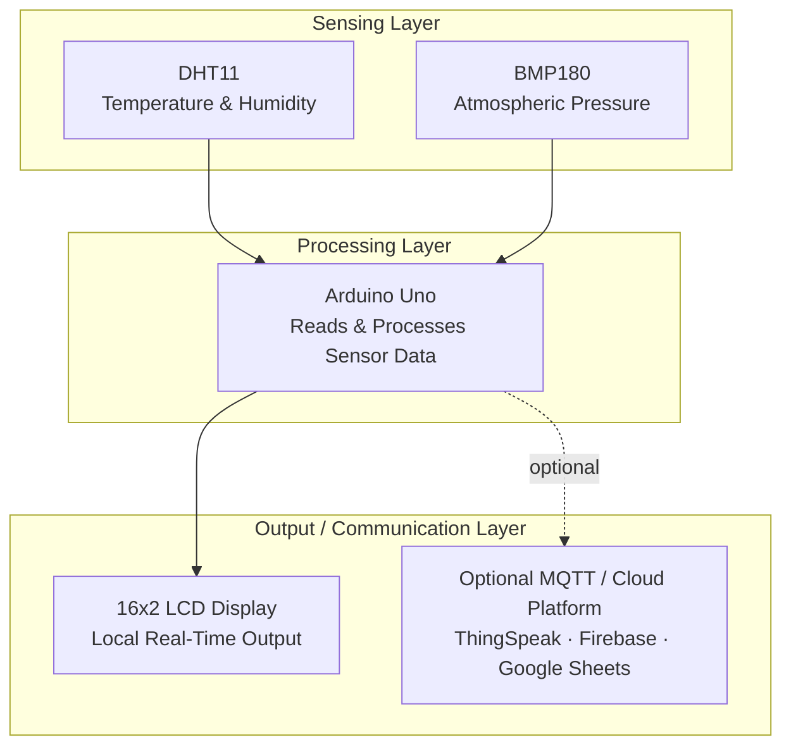
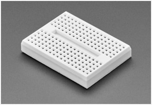
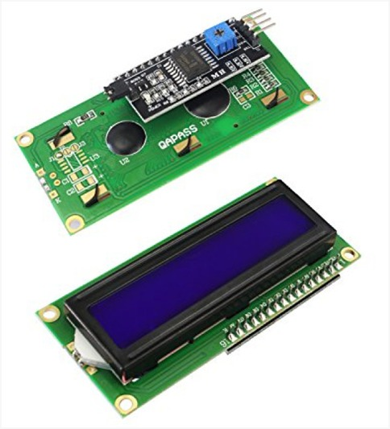

<h1 align="center">🌡️ IoT Weather Monitoring System</h1>

  <b>A real-time embedded system that senses, processes, and displays environmental data locally —</b> 
  built as a foundation for scaling into edge-computing and cloud-connected IoT architectures.

  
  
  

---

## 📌 Overview

The **IoT Weather Monitoring System** is a real-time embedded system that captures environmental parameters — **temperature, humidity, and atmospheric pressure** — using low-cost sensors interfaced with a microcontroller, processes the readings locally, and displays them on an LCD in real time.

While built as a solo academic project for my BCA program, it's designed around the same layered sensing → processing → output architecture used in production IoT deployments. The current implementation processes and displays data locally (a lightweight form of **edge computing** — handling data at the source rather than shipping every raw reading to the cloud), with the architecture structured so that adding **MQTT-based messaging** for cloud/broker communication is a natural next layer rather than a redesign. That distinction — processing at the edge vs. transmitting everything — is deliberate: it keeps the system responsive and functional even without a network connection, which mirrors how real-world IoT sensor networks are designed to degrade gracefully.

---

## 🎯 Objectives

- Monitor temperature, humidity, and atmospheric pressure in real time
- Design a cost-effective, portable weather monitoring solution
- Process sensor data locally at the edge before any optional cloud transmission
- Display live readings on an LCD for immediate on-site monitoring
- Provide a scalable base for future enhancements such as MQTT-based cloud integration

---

## ⚙️ System Features

- Real-time temperature and humidity monitoring using **DHT11**
- Atmospheric pressure measurement using **BMP180**
- Live data display on a **16×2 LCD with I2C module**
- Stable sensor readings with calibration and error handling
- Modular, expandable architecture designed for edge-first processing
- Optional cloud integration pathway for remote monitoring

---

## 🧩 Hardware Components

| Component | Role |
|---|---|
| 🧠 Arduino Uno | Microcontroller — reads and processes sensor data |
| 🌡️ DHT11 Sensor | Temperature & humidity measurement |
| 🌬️ BMP180 Sensor | Atmospheric pressure measurement |
| 📟 16×2 LCD + I2C Module | Local real-time data display |
| 🔌 Breadboard | Circuit prototyping |
| 🔗 Jumper Wires | Component interconnects |
| 🔋 USB / Battery Supply | Power source |

---

## 💻 Software & Tools

**Environment:** Arduino IDE · C/C++

**Libraries:**
- `DHT.h`
- `Adafruit_BMP085.h`
- `LiquidCrystal_I2C.h`

**Optional Cloud/Edge Extensions:**
- ThingSpeak
- Firebase
- Google Sheets
- MQTT broker (e.g., Mosquitto) — for scalable, low-bandwidth sensor-to-cloud messaging

---

## 🏗️ System Architecture

---

## 🔄 Working Principle

1. Sensors capture environmental parameters (temperature, humidity, pressure)
2. Arduino reads and processes raw sensor values using dedicated libraries
3. Processed data is displayed on the LCD in real time
4. *(Optional)* Data is published to a cloud platform or MQTT broker for remote monitoring
5. The system updates readings continuously at regular intervals

---

## 📷 Project Output

  
  &nbsp;&nbsp;
  

<i>Left: full breadboard circuit setup. Right: live sensor readings on the 16×2 I2C LCD.</i>

---

## 🧪 Testing & Results

- System tested in both indoor and outdoor environments
- Sensor readings remained stable and consistent under normal conditions
- Real-time updates displayed without noticeable delay
- Minor fluctuations observed due to environmental changes — expected and within normal sensor tolerance

---

## ✅ Advantages

- Low-cost and energy-efficient
- Easy to implement and reproduce
- Real-time local data monitoring, no cloud dependency required
- Modular, expandable design
- Suitable for both academic and real-world applications

---

## ⚠️ Limitations

- Limited sensor accuracy under extreme conditions
- Cloud/MQTT features depend on Wi-Fi availability
- Limited display capacity on the 16×2 LCD
- Arduino Uno has constrained processing power for large-scale data handling

---

## 🚀 Future Enhancements

- [ ] Upgrade to higher-precision sensors (DHT22, BMP280)
- [ ] Integrate **MQTT** for lightweight, scalable publish/subscribe cloud communication
- [ ] Add **edge-computing logic** (e.g., on-device anomaly detection before transmission) to reduce bandwidth use
- [ ] Integrate long-range communication (LoRa, NB-IoT) for remote deployments beyond Wi-Fi range
- [ ] Add solar power support for fully off-grid operation
- [ ] Develop a companion mobile app for remote monitoring
- [ ] Apply time-series analytics/ML for short-term weather prediction

---

## 👤 Author

**Henil Shah**
Software Developer | Backend & Automation Specialist
📍 Nagpur, Maharashtra, India

---

## 📜 License

This project is developed for academic and learning purposes. You are free to use and modify it with proper attribution.
